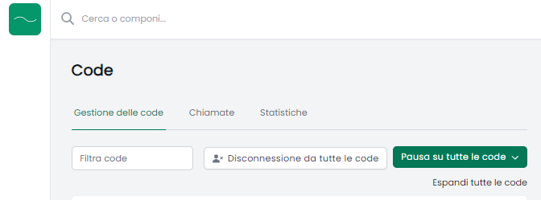
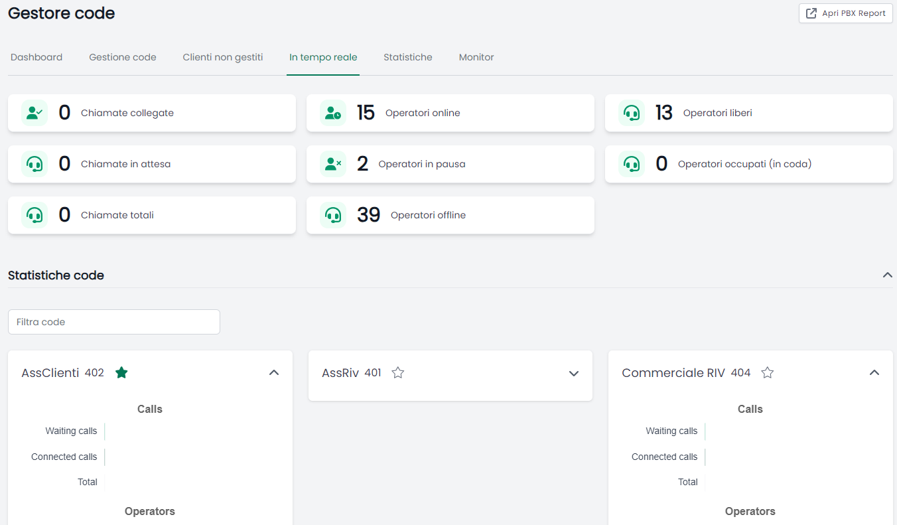

.. _cti-section:

=======
Manuale
=======

NethVoice CTI è il client web di `NethVoice <https://www.nethesis.it/soluzioni/nethvoice>`_

Consente di telefonare e collaborare con clienti e colleghi tramite il tuo browser.

Come Accedere
-------------
L'accesso avviene tramite browser Web:

.. image:: _static/Pagina_Login.png
   :width: 200

Il link di collegamento e le credenziali di accesso sono specifiche dell'installazione e vengono comunicate in fase di avviamento.

Effettuare e gestire chiamate
-----------------------------
Per poter chiamare puoi digitare il numero di telefono, oppure cercare il nome o numero del tuo contatto nella barra "Cerca o componi".

.. image:: _static/Chiamare.png
   :width: 200

Durante la chiamata si aprirà la *Phone Island*:

La *Phone Island* è il nuovo strumento dedicato alla gestione della telefonata.

Tramite la *Phone Island* è possibile:
 * Mettere in pausa la telefonata;
 * Silenziare il microfono;
 * Trasferire la chiamata: una volta cliccato digitare il nome o il numero del contatto a cui vuoi trasferire;
 * Aprire il tastierino numerico;
 * Parcheggiare la telefonata (soggetto a specifico permesso);

La *Phone Island* è uno strumento dinamico che puoi spostare, trascindola, ovunque nello schermo.

Gestire la Presence ed il Dispositivo principale
------------------------------------------------
Cliccando sul tuo Avatar NethVoice CTI ti consente di gestire la tua Presence ed il tuo dispositivo telefonico principale.

Presence
^^^^^^^^
Comunica ai tuoi colleghi il tuo stato telefonico per far sapere se sei presente o se non puoi ricevere telefonate:

Il colore del tuo stato cambierà di conseguenza.

Dispositivo principale
^^^^^^^^^^^^^^^^^^^^^^
Se hai a disposizione più telefoni puoi scegliere da qui quale utilizzare per telefonare:

.. image:: _static/Dispositivo_Principale.png
   :width: 200

Chiamata Rapida e Ultime Chiamate
---------------------------------
Puoi aggiungere contatti da chiamare rapidamente tramite il menù di chiamata rapida:

Oppure visualizzare le ultime chiamate fatte o ricevute:

.. image:: _static/Ultime_Chiamate_Destra.png
   :width: 200

Panello operatore
-----------------
Ti permette di visualizzare in tempo reale lo stato dei tuoi colleghi:

.. image:: _static/Pannello_Operatore.png
   :width: 200

Da qui puoi chiamarli, controllarne la disponibilità, filtrare ed organizzarne la visualizzazione in pochi click.

Code
----
Se utilizzi le *Code* da qui puoi controllarle:

.. image:: _static/Code.png
   :width: 200

Gestione delle code:
^^^^^^^^^^^^^^^^^^^^
Controlla le chiamate in arrivo oppure in gestione da parte dei colleghi:

.. image:: _static/Code.png
   :width: 200

Con il bottone "Accedi\Esci" puoi entrare o uscire da una specifica coda.
Con il pulsante "Pausa" puoi temporaneamente evitare di ricevere telefonate.
Tramite un unico bottone puoi gestire tutte le code contemporaneamente:

Chiamate:
^^^^^^^^^
Verifica se hai perso qualche chiamata e richiama i tuoi clienti:

.. image:: _static/Code_Chiamate.png
   :width: 200

Statistiche:
^^^^^^^^^^^^
Controlla le tue statiche telefoniche all'interno delle code:

Rubrica
-------
Puoi visualizzare la rubrica di Nethvoice CTI:

.. image:: _static/Rubrica_Sinistra.png
   :width: 200

Oppure aggiungere nuovi contatti con la funzione "Crea Contatto" (soggetto a specifico permesso):

.. image:: _static/crea_contatto.png
   :width: 200

Storico
-------
Tramite comodi filtri puoi ricercare le chiamate del tuo interno, gruppo o dell'intero centralino telefonico (soggetto a specifico permesso):

Gestore Code
------------
Da qui puoi amministrare le code configurate sul centralino telefonico (soggetto a specifico permesso):

Dashboard:
^^^^^^^^^^
Visualizza un riepilogo della situazione di tutte le code configurate sul sistema:

Puoi vedere da qui anche grafici e statistiche. 

Gestione code:
^^^^^^^^^^^^^^
Per ciascuna coda puoi vedere il dettaglio delle chiamate gestite e governare il comportamento degli agenti:

 

Clienti non gestiti:
^^^^^^^^^^^^^^^^^^^^
Da qui puoi verificare velocemente se tutte le chiamate sono state risposte:

In tempo reale:
^^^^^^^^^^^^^^^
Riepilogo della situazione delle code in tempo reale:

Si possono filtrare le singole code o i singoli operatoti per verificarne l'andamento della giornata lavorativa.

Statistiche:
^^^^^^^^^^^^
Grafici di riepilogo della situazione delle code:

Monitor:
^^^^^^^^
Visualizza su un monitor l'elenco delle chiamate in coda:

Applicazioni
------------

.. image:: _static/Applicazioni.png
   :width: 200

Linee telefoniche e annunci:
^^^^^^^^^^^^^^^^^^^^^^^^^^^^
Qui trovi e gestisci le linee telefoniche del centralino (soggetto a specifico permesso):

.. image:: _static/Linee_telefoniche_e_annunci_gestione_linee.png
   :width: 200

Dettagli linea
~~~~~~~~~~~~~~
Clicca sulla tua linea telefonica per controllare le chiusure:

.. image:: _static/Dettagli_linea.png
   :width: 200

Potrai da qui controllare:
 * Quando attivare la chiusura: attivare manualmente la chiusura, selezionare uno specifico giorno o un periodo di inizio e fine automatico;
 * Far sentire un annuncio;
 * Far sentire un annuncio e lasciare un messaggio in segreteria telefonica;
 * Inoltrare la telefonata.

Annunci
~~~~~~~
Tramite il menù Annunci puoi caricare o registrare un nuovo annuncio. Puoi anche riascoltare o eliminare gli annunci già presenti (soggetto a specifico permesso):

Sorgenti video:
^^^^^^^^^^^^^^^
Ci stiamo lavorando. Da qui potrai vedere e controllare i tuoi videocitofoni (soggetto a specifico permesso).

PBX Report:
^^^^^^^^^^^
La `Reportistica avanzata <https://docs.nethvoice.it/it/latest/pbxreport_manual.html>`_ del centralino telefonico (soggetto a specifico permesso).

Impostazioni
------------
Puoi personalizzare il tuo *NethVoice CTI* accedendo alle Impostazioni:

.. image:: _static/Impostazioni.png
   :width: 200

Da qui puoi vedere:
 * Dispositivi: ti consente di controllare i tuoi telefoni ed il loro stato;
 * App mobile: genera il codice QR per collegare il tuo `smartphone <https://docs.nethvoice.it/it/latest/app_manual.html>`_ (soggetto a specifico permesso);
 * Scheda cliente: controlla come si comporta la scheda cliente (soggetto a specifico permesso);
 * Code: decidi come automatizzare il tuo accesso alle code (soggetto a specifico permesso);
 * Immagine profilo: modifica il tuo avatar;
 * Tema: scegli il tema chiaro o scuro in base alle tue preferenze;
 * Integrazioni: utile per integrare la tua *Phone Island* con strumenti esterni;
 * Cache: svuotare la cache del tuo browser può aiutare a risolvere alcuni problemi di caricamento della pagina.

Browser Supportati
------------------
I Browser attualmente supportati sono:
 * Google Chrome - Versione 121.0.6167.189
 * Mozilla Firefox - Versione 123.0
 * Microsoft Edge - Versione 122.0.2365.59
